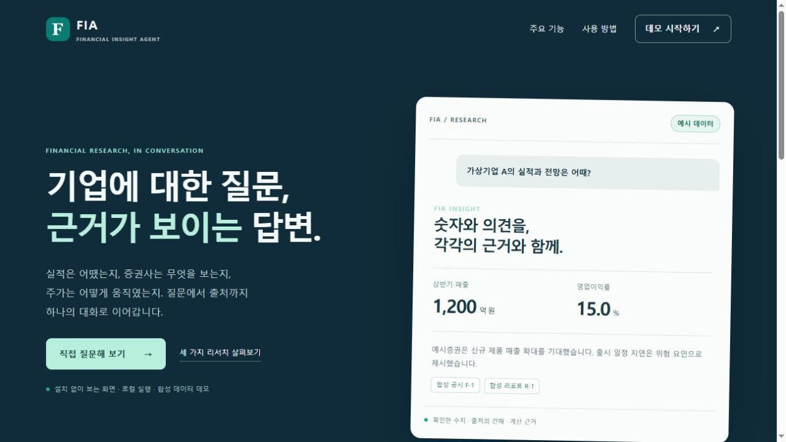
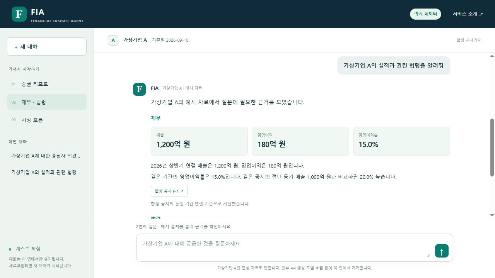
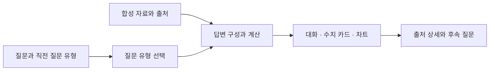

# FIA · Financial Insight Agent

**기업에 대한 질문, 근거가 보이는 답변.**

FIA는 증권 리포트, 재무·법령, 시장 흐름을 하나의 대화에서 살펴보는 금융 리서치 인터페이스입니다.
답변의 숫자와 출처의 의견을 구분하고, 궁금한 근거를 펼치거나 계산 방법을 이어서 물어볼 수 있습니다.

[빠른 실행](#빠른-실행) · [질문과 답변 예시](#질문과-답변-예시) · [설계와 코드](#설계와-코드) · [5분 시연](PORTFOLIO_WALKTHROUGH.md)



이 저장소에서는 **가상기업 A의 합성 자료로 동작하는 채팅 데모**와 Python 기반 근거 처리 코드를 실행할 수 있습니다.
스크린샷은 이 데모를 브라우저에서 직접 실행해 캡처했습니다.

## 세 가지 리서치

| 질문 유형 | 보여주는 내용 | 이어서 확인할 수 있는 것 |
|---|---|---|
| 증권 리포트 | 투자의견·목표가, 전망의 근거와 위험 | 발행 주체·날짜·페이지, 의견의 원문 예시 |
| 재무·법령 | 같은 기간의 매출·이익·이익률과 관련 조문 | 계산식·피연산자, 조문 내용과 적용 여부의 구분 |
| 시장 흐름 | 날짜별 가격 관측과 변화 | 차트·관측값 목록, 상승하지 않은 구간 |

질문 유형을 바꿔도 같은 화면에 대화가 이어집니다. 후속 질문은 직전 질문 유형을 활용하며,
`새 대화`를 누르거나 페이지를 새로고침하면 대화가 초기화됩니다.



## 직접 체험하는 흐름

1. 홈페이지에서 **데모 시작하기**를 누릅니다. 계정이나 API 키 입력은 필요하지 않습니다.
2. 예시 질문을 선택하거나 가상기업 A에 대한 질문을 입력합니다.
3. 답변 아래 **출처 버튼**에서 발행일·위치·원문 예시를 확인합니다.
4. **“영업이익률은 어떻게 계산했어?”**, **“매일 상승한 거야?”**처럼 이어서 질문합니다.

대화는 브라우저 탭 메모리에서 유지되며, 질문은 최대 600자·한 대화는 최대 20턴을 지원합니다.

## 질문과 답변 예시

아래 회사·수치·리포트·조문은 모두 화면 체험용 합성 시나리오입니다.

### 1. 증권사의 견해와 근거

**질문** · 가상기업 A에 대한 증권사 의견은?

> 예시증권은 투자의견 ‘매수’와 목표주가 12,000원을 제시했습니다.
> 신규 제품 매출 확대와 원가율 개선을 기대했습니다.
> 출시 일정 지연과 원재료 가격 상승을 위험 요인으로 제시했습니다.

**출처** · 합성 리포트 R-1, 2026-09-01, 1~2페이지.

### 2. 재무 수치와 계산

**질문** · 가상기업 A의 실적과 관련 법령을 알려줘

> 2026년 상반기 연결 매출은 1,200억 원, 영업이익은 180억 원입니다.
> 같은 기간의 영업이익률은 15.0%입니다.
> 같은 공시의 전년 동기 매출 1,000억 원과 비교하면 20.0% 높습니다.

**후속 질문** · 영업이익률은 어떻게 계산했어?

> 영업이익을 같은 기간의 매출로 나눠 계산합니다.
> 180 ÷ 1,200 × 100 = 15.0%입니다.

**출처** · 합성 공시 F-1, 설명용 가상 조문 L-1.

### 3. 시장 관측과 후속 질문

**질문** · 가상기업 A의 최근 주가 흐름을 알려줘

> 2026-09-01 10,000원에서 2026-09-07 10,500원으로,
> 두 종가 필드의 단순 차이는 +500원입니다.
> 현재 예시는 5개 관측일을 포함합니다.

**후속 질문** · 매일 상승한 거야?

> 매 관측일마다 상승하지는 않았습니다.
> 9월 2일 10,200원에서 9월 3일 10,100원으로 낮아진 구간이 있습니다.

**출처** · 합성 시장 관측 M-1. 차트와 날짜별 목록에서 다섯 관측값을 확인할 수 있습니다.

## 빠른 실행

Python 3.11 이상과 ES modules를 지원하는 브라우저가 필요합니다.
외부 Python 패키지나 API 키 없이 실행합니다.

```sh
python -I run.py serve --port 8765
```

브라우저에서 `http://127.0.0.1:8765/`를 엽니다.
포트가 사용 중이거나 시스템에서 예약한 포트이면 `--port 18765`처럼 다른 포트를 지정합니다.

| 주소 | 화면 |
|---|---|
| `/` | FIA 홈페이지 |
| `/chat` | 합성 자료 기반 채팅 |
| `/chat?topic=report` | 리포트 질문으로 바로 시작 |
| `/chat?topic=financial` | 재무·법령 질문으로 바로 시작 |
| `/chat?topic=market` | 시장 질문으로 바로 시작 |
| `/replay` | 기존 저장 사례의 질문별 근거 조회 |

## 설계와 코드

### 대화 화면



- **`web/chat-engine.mjs`**: 제한된 질문 유형을 구분하고 출처가 있는 답변 객체를 구성합니다.
- **`web/chat.mjs`**: 대화 상태, 수치 카드, 차트, 출처 상세 창을 연결합니다.
- **`web/app.css`**: 홈페이지와 채팅의 화면 구성, 반응형 레이아웃, 키보드 포커스를 정의합니다.
- **`demo/chat-scenarios.json`**: 합성 수치와 원문 예시를 한 파일에서 관리합니다.

채팅 답변은 브라우저에서 질문 유형과 합성 자료를 연결해 구성합니다.
Python 근거 처리 모듈은 별도 실행 경로로 구성했습니다.

### 근거 처리 모듈

Python 코드는 기업 식별, 자료 시점, 출처 연결, 계산, 작업 복구를 독립적으로 검증할 수 있게 구성했습니다.

| 관심사 | 코드 | 확인할 설계 |
|---|---|---|
| 기업 식별 | [company_runtime.py](src/fia_public/company_runtime.py) | 이름·종목코드·별칭 해석과 모호한 입력 구분 |
| 자료 재사용 | [freshness.py](src/fia_public/freshness.py) | 최신성·부재·오래된 자료의 구분 |
| 작업 상태 | [durable_runtime.py](src/fia_public/durable_runtime.py) | 중복 요청, 실행권, 재시작 상태 전이 |
| 문서 근거 | [report_retrieval.py](src/fia_public/report_retrieval.py) | 검색 후보와 원본 청크의 회사·출처 일치 확인 |
| 재무 근거 | [financial_pipeline.py](src/fia_public/financial_pipeline.py) | 기간·연결/별도·단위·공시 버전 정규화 |
| 시장 계산 | [market_pipeline.py](src/fia_public/market_pipeline.py) | 날짜 정렬·가격 관계 확인과 시계열 계산 |
| 저장 정합성 | [storage_reconciliation.py](src/fia_public/storage_reconciliation.py) | 원본 레코드와 검색 색인의 누락·불일치 분류 |
| 서비스 조립 | [service_runtime.py](src/fia_public/service_runtime.py) | 준비된 근거 반환과 중복 작업 방지 |

검색 점수와 사실 확인을 분리하고, 증권사 전망과 공시 실적을 같은 역할로 취급하지 않는 것이 핵심입니다.
상세 호출 관계는 [아키텍처 문서](docs/architecture.md)에서 확인할 수 있습니다.

### 실행 구성

| 계층 | 기술 |
|---|---|
| 홈페이지·채팅 | HTML, CSS, JavaScript ES modules, SVG |
| 로컬 HTTP·근거 처리 | Python 표준 라이브러리 |
| 검증 | Python unittest, Node.js 기본 test runner |

런타임 패키지 설치나 프런트엔드 빌드 과정이 없습니다.
기존 `/api/analysis`와 `smoke`는 저장 사례 검증용 경로로 유지합니다.

## 검증

```sh
python scripts/check.py
node --test tests/chat-engine.test.mjs
```

첫 명령은 Python 문법·단위시험과 저장 사례의 결정론적 실행을 검사합니다.
두 번째 명령은 Node.js 20 이상에서 질문 분기, 후속 맥락, 계산값, 출처 연결을 검사합니다.
Node.js는 JavaScript 시험에만 필요하며 데모 서버 실행에는 필요하지 않습니다.

브라우저에서는 세 질문의 연속 전환, 출처 열기·닫기, 후속 질문, 새 대화와 새로고침을 확인합니다.

## 저장소 구성

```text
web/                       홈페이지·채팅 UI와 답변 구성
demo/chat-scenarios.json    가상기업 A의 합성 자료
demo/                      기존 저장 사례
src/fia_public/            근거 처리 모듈·HTTP 서버
tests/                     Python·JavaScript 회귀시험
docs/assets/               실제 데모 화면과 설계 이미지
run.py                     로컬 실행 진입점
scripts/check.py           Python 검증 명령
Dockerfile / compose.yaml  컨테이너 실행 설정
```
