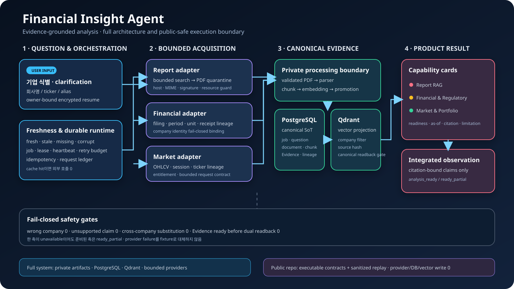

# Financial Insight Agent

> 기업 분석에 필요한 금융 리포트, 공시 재무, 규제 근거, 시장 데이터를
> **회사·기준일·출처 계보(lineage)**로 결박하고, 인용 가능한 주장만 사용자 질문에 맞게
> 조립하는 evidence-first 금융 분석 프로토타입입니다.



Financial Insight Agent는 “검색 결과를 자연스럽게 요약하는 것”보다
**어떤 근거가 어떤 회사를 설명하며, 언제 수집됐고, 어떤 검증을 통과했는지**를
보존하는 데 초점을 둡니다. 한 데이터 축이 준비되지 않았을 때 다른 기업의 자료나
근거 없는 추론으로 빈칸을 채우지 않고, 준비된 축만 `ready_partial`로 제공합니다.

이 저장소는 포트폴리오 검토를 위한 공개 실행 경계입니다. 승인된 비식별
recorded replay와 synthetic contract test만 포함하며, 실행 중 외부 데이터 provider,
네트워크 API, 생성 모델을 호출하거나 파일·데이터베이스에 결과를 쓰지 않습니다.

## 한눈에 보기

| 구분 | 내용 |
|---|---|
| 해결하려는 문제 | 갱신 주기와 구조가 다른 금융 근거를 섞을 때 발생하는 stale data, 회사 혼입, 수치·단위 혼동, citation 유실 |
| 핵심 접근 | 데이터를 바로 답변으로 만들지 않고 `수집 → 검증 → 정규화 → canonical readback → Evidence → 질문별 projection` 단계로 분리 |
| 사용자 결과 | Report RAG, Financial & Regulatory Evidence, Market & Portfolio Analytics와 citation-bound 통합 관찰 |
| 신뢰성 계약 | canonical company identity, source hash, as-of, lineage, idempotent job, partial-ready, fail-closed |
| 공개 실행 | 단일 기업 recorded replay 5개 시나리오와 범용 runtime의 dependency-free synthetic test |
| 공개하지 않는 것 | credential, provider client, 원문 PDF, 실제 DB/vector, raw payload, private catalog |

## 기술 구성

| 영역 | 전체 시스템에서의 역할 | 공개 저장소에서 확인하는 범위 |
|---|---|---|
| Python | 수집 orchestration, 검증, 정규화, Evidence 조립, API/UI | 표준 라이브러리만으로 실행되는 계약·알고리즘·로컬 데모 |
| Report RAG | PDF parsing, chunking, embedding, 질문별 retrieval | PDF 진입 보안, canonical chunk readback, citation locator 계약 |
| PostgreSQL | document·chunk·Evidence·durable job의 canonical SoT | storage-neutral row와 상태 전이 모델 |
| Qdrant | canonical chunk의 vector search projection | hit 검증, orphan·누락·lineage reconciliation 알고리즘 |
| Financial/Market pipeline | 공시 fact와 OHLCV 정규화·계산 | synthetic input 기반 period·unit·receipt·session 검증 |
| Docker | 재현 가능한 로컬 실행과 운영 경계 | non-root, read-only, loopback, capability drop 구성 |

공개 저장소는 실제 provider adapter나 PostgreSQL/Qdrant 인스턴스를 포함하지 않습니다.
대신 외부 시스템이 없어도 핵심 설계 판단과 실패 조건을 실행 가능한 테스트로 검토할 수
있도록 구성했습니다.

## 왜 이 구조가 필요한가

금융 분석 파이프라인에서는 검색 정확도만 높아도 다음 문제가 남습니다.

1. **회사 혼입** — 유사한 회사명이나 잘못된 ticker의 문서가 검색 결과에 포함될 수 있습니다.
2. **시점 혼입** — 오래된 리포트와 최신 공시가 같은 시점의 사실처럼 조립될 수 있습니다.
3. **출처 역할 혼동** — 증권사 전망치를 공시 실적으로, 공시 실적을 전망치로 표현할 수 있습니다.
4. **vector 과신** — 유사도 점수가 높다는 이유만으로 canonical document와 lineage 확인 없이 근거를 승인할 수 있습니다.
5. **부분 실패 은폐** — 한 데이터 축이 실패했을 때 다른 기업 자료나 fixture로 결과를 채울 수 있습니다.
6. **중복 처리** — 같은 문서와 질문이 반복될 때 재수집·재파싱·재임베딩이 발생할 수 있습니다.

이 프로젝트는 각 문제를 모델의 주의력에 맡기지 않고, 상태 머신과 데이터 계약으로
차단합니다. 모든 축에서 반복되는 설계 원칙은 다음과 같습니다.

```text
identity → freshness → bounded work → lineage → canonical readback
         → Evidence promotion → question-scoped projection → fail-closed
```

## 사용자 질문에서 결과까지

### 1. 기업 식별과 clarification

기업명, ticker, alias를 canonical company ID로 해석합니다. 입력이 여러 기업을 가리키면
임의 선택하지 않고 `clarification_required`와 후보를 반환합니다. 후보 선택 시에도
처음 요청한 질문, 분석 축, 기준일을 복구하고 후보 목록 밖 ID 주입은 차단합니다.

- exact name·ticker·alias resolution
- ambiguous input 분리
- candidate tamper 차단
- 회사 간 cache·Evidence 공유 금지

### 2. 축별 freshness 판정

데이터가 존재한다는 사실과 최신이라는 사실을 분리합니다. Report는 발행일과 마지막
source check를 구분하고 7~14일 정책, negative cache, artifact integrity를 사용합니다.
Financial은 Report TTL을 복사하지 않고 공시 기간, 보고서 코드, receipt version을
기준으로 freshness를 판단합니다.

```text
fresh_cache_hit       → provider 작업 없이 기존 Evidence 사용
missing               → bounded acquisition 필요
stale                 → 기존 corpus를 보존한 채 refresh 필요
negative_cache_hit    → 확인된 no-source 결과 재사용
corrupt / mismatch    → 결과 승격 없이 fail-closed
```

### 3. Durable acquisition

missing 또는 stale 축만 durable job으로 전환합니다. 질문 hash, 회사, 요청 축, 기준일로
idempotent identity를 만들며 lease, revision, 허용 상태 전이와 restart snapshot을
검증합니다. 같은 요청이 동시에 들어와도 논리적으로 하나의 작업만 유지하는 계약입니다.

공개 구현은 storage-neutral reference implementation입니다. 실제 PostgreSQL 연결이나
암호화된 질문 원문을 포함하지 않고, 중복 요청·lease loss·재시작 상태 전이를 외부
서비스 없이 재현합니다.

### 4. 비신뢰 입력 검증

외부 PDF는 parser에 바로 전달하지 않습니다. host, MIME, `%PDF-` signature, 크기,
암호화, embedded file, active content, page/object resource limit을 검사하고 안전하지 않은
입력은 ready corpus로 승격하지 않습니다.

```text
downloaded → quarantined → validated_for_parser → private candidate
          ↘ rejected / timeout / resource limit → no promotion
```

### 5. 정규화와 저장

검증된 자료는 회사·source hash·기간·단위·parser/schema version을 보존하는 canonical
Evidence로 정규화합니다. 전체 시스템에서는 PostgreSQL이 canonical metadata와 chunk의
기준이며 Qdrant는 검색 projection입니다.

Qdrant 검색 결과는 곧바로 답변 근거가 되지 않습니다. PostgreSQL canonical row에서
company, source, chunk, lineage와 promotion 상태를 다시 확인한 뒤에만 Evidence로
사용합니다.

### 6. 질문별 retrieval

같은 corpus를 사용하더라도 질문마다 선택되는 근거는 달라야 합니다. Report Evidence는
질문 hash에 결박되며 검색 점수와 별개로 다음 조건을 모두 통과해야 합니다.

- canonical company 일치
- source hash와 chunk ID 일치
- parser/schema lineage 일치
- `no_promote` 또는 quarantine artifact 제외
- page·bbox·paragraph locator 존재

### 7. 축별 결과와 통합 관찰

Report 전망과 Financial actual은 서로 다른 source role로 유지합니다. metric과 unit이
호환되고 양쪽 citation을 모두 확보한 structured descriptor가 있을 때만 방향 일치 또는
차이를 비교합니다. 원인, 목표가 타당성, 매수·매도 판단은 새로 생성하지 않습니다.

### 8. API/UI projection

준비된 capability만 결과에 포함합니다.

- 요청 축이 모두 준비됨: `analysis_ready`
- 하나 이상의 축만 준비됨: `ready_partial`
- 준비된 축이 없음: reason code가 있는 unavailable/failed 상태
- 수집이 필요함: durable commit 이후 `202 acquisition_in_progress`

## 세 가지 capability

| Capability | 처리하는 근거 | 보존하는 정보 | 대표 안전장치 |
|---|---|---|---|
| **Report RAG** | 증권사·금융 리포트 | 문서, page, bbox/paragraph, source hash | 질문별 retrieval, company·lineage canonical readback |
| **Financial & Regulatory Evidence** | 공시 재무와 검토된 규제 근거 | fiscal period, metric, unit, 연결/별도, receipt version, article locator | 전망/실적 역할 분리, period·unit mismatch 차단 |
| **Market & Portfolio Analytics** | ordered OHLCV와 검증된 시장 근거 | ticker, session, dataset hash, as-of | 61~66 session 검증, 중복·가격 관계·finite value 검사 |

### Report RAG

공개 Report 파이프라인은 parser나 embedding model을 다시 구현하지 않습니다. 대신
비신뢰 PDF가 parser 경계에 진입하기 위한 조건과 vector hit가 최종 Evidence로 승격되는
조건을 실행 가능한 코드로 보여줍니다.

- [PDF security boundary](src/fia_public/pdf_security.py)
- [Canonical retrieval readback](src/fia_public/report_retrieval.py)
- [Recorded Report projection](src/fia_public/report_rag.py)

### Financial & Regulatory Evidence

재무 숫자 문자열은 Evidence ID를 만들기 전에 canonical decimal로 정규화합니다.
표현이 `1,250.00`과 `1250`으로 달라도 같은 회사·기간·metric·unit·receipt라면 같은
fact identity를 갖습니다. 공시 version이 변경되면 기존 Evidence는 stale로 판정됩니다.

- [Financial normalization](src/fia_public/financial_pipeline.py)
- [Recorded Financial projection](src/fia_public/financial_evidence.py)
- [Regulatory evidence](src/fia_public/regulatory_evidence.py)

법령은 reviewed scope 안의 조문 locator만 제공하며 개별 사안에 대한 직접 적용성을
확정하지 않습니다.

### Market & Portfolio Analytics

caller가 제공한 61~66개 OHLCV row의 ticker, 날짜 정렬, 중복, 가격 관계, finite value를
검증한 뒤에만 dataset hash와 20/60-session return, annualized volatility,
SMA20/SMA60을 계산합니다.

- [Market normalization and calculations](src/fia_public/market_pipeline.py)
- [Recorded market projection](src/fia_public/market_analytics.py)
- [Ephemeral portfolio risk](src/fia_public/portfolio_risk.py)

테스트 시계열은 알고리즘 검증용 synthetic data이며 실제 종목 성과로 표시하지 않습니다.

## PostgreSQL과 Qdrant의 역할

전체 시스템은 PostgreSQL과 Qdrant를 서로 대체 가능한 저장소로 취급하지 않습니다.

| 저장 계층 | 역할 |
|---|---|
| PostgreSQL | document·chunk·Evidence identity, company binding, source lineage의 canonical SoT |
| Qdrant | canonical chunk를 검색하기 위한 vector projection |
| Private artifact storage | 검증된 원문 PDF와 parser 입력을 공개 경계 밖에서 보존 |

[Storage reconciliation](src/fia_public/storage_reconciliation.py)은 다음 상태를 구분합니다.

- active canonical row에 대응하는 vector 누락
- canonical row 없는 orphan point
- payload의 company·source·lineage 불일치
- 기존 vector를 이용한 no-reembedding rebuild 가능 상태
- 복구 입력이 없는 unreferenced legacy quarantine

양쪽 write-readback이 일치하기 전에는 Evidence를 ready로 승격하지 않습니다. 공개 코드는
실제 DB credential이나 vector 값을 포함하지 않고 reconciliation 결정 알고리즘만
실행합니다.

## 핵심 설계 결정

### Retrieval score는 authorization이 아니다

유사도 점수는 후보 순위를 정하는 신호일 뿐입니다. 해당 chunk를 답변에 사용할 수
있는지는 canonical company, source, lineage, promotion 상태가 결정합니다.

### Partial-ready는 실패의 은폐가 아니다

한 축의 부재가 전체 결과를 막지는 않지만, 준비되지 않은 축을 다른 자료로 채우지도
않습니다. 사용자는 준비된 결과와 unavailable reason을 동시에 확인할 수 있습니다.

### 축별 freshness 정책을 분리한다

리포트, 공시, 시장 데이터는 갱신 조건이 다릅니다. 하나의 TTL을 모든 데이터에 적용하면
불필요한 재수집 또는 오래된 데이터 재사용이 발생하므로 각 축의 version·period·source
check를 독립적으로 관리합니다.

### 같은 입력은 같은 결과를 만든다

canonical serialization과 hash 기반 identity로 idempotency를 유지합니다. 공개 smoke는
동일 입력을 반복 실행해 byte-equivalent 결과와 provider/network/model 호출 0을
확인합니다.

## 보안과 실패 경계

- credential, API key, DB URL, raw provider payload를 코드·로그·응답에 기록하지 않습니다.
- public mode에서는 provider, private artifact, 실제 DB/vector 경로를 실행하지 않습니다.
- PDF 본문의 문장을 시스템 지시나 tool instruction으로 해석하지 않습니다.
- company·source·lineage mismatch는 fallback이 아니라 fail-closed입니다.
- Docker는 non-root user, read-only filesystem, dropped Linux capabilities로 실행합니다.
- 데모 서버는 loopback에 바인딩되고 GET 요청만 허용합니다.

세부 정책은 [SECURITY.md](SECURITY.md)에서 확인할 수 있습니다.

## 공개 데모에서 확인할 수 있는 것

공개 replay는 엔씨소프트 한 기업과 다음 controlled intent를 지원합니다.

1. 금융 리포트 근거
2. 공시 재무 근거
3. 규제 조문 근거
4. 시장 근거
5. 준비된 축의 통합 결과

질문 표현을 지원 범위에 매핑할 수 없거나 서로 다른 intent가 모호하게 섞이면 추측하지
않고 reason code와 함께 차단합니다. 범용 runtime test의 회사와 데이터는 synthetic
record이며 actual 다기업 분석 성공으로 계산하지 않습니다.

## 빠른 실행

Python 3.11 이상만 필요합니다. 외부 패키지를 설치하지 않고 실행할 수 있습니다.

```powershell
python -I run.py smoke
python -I run.py serve --port 8765
```

브라우저에서 `http://127.0.0.1:8765/`을 열면 질문 선택형 UI를 확인할 수 있습니다.

Docker 실행:

```powershell
docker compose --env-file docker/portfolio.env.example up --build
```

Dockerfile은 digest-pinned Python image, non-root user, health check를 사용합니다. Compose는
loopback binding, read-only filesystem, tmpfs, capability drop, no-new-privileges를
적용합니다.

## 검증

```powershell
python scripts/check.py
```

검증기는 다음 순서로 실행됩니다.

1. Python syntax 검사
2. dependency-free unit test 56개
3. 공개 데모의 deterministic smoke
4. provider·network·LLM 호출 수 0 확인
5. unsupported claim 수 0 확인

대표 smoke 결과:

```json
{
  "deterministic_smoke": true,
  "provider_call_count": 0,
  "network_call_count": 0,
  "llm_call_count": 0,
  "status": "ready"
}
```

## 저장소 구성

```text
demo/                         sanitized recorded replay
src/fia_public/               공개 가능한 실행 계약과 알고리즘
tests/                        dependency-free contract tests
docs/assets/architecture.svg  아키텍처 다이어그램
run.py                        smoke·로컬 서버 진입점
scripts/check.py              공개 경계 검증기
Dockerfile / compose.yaml     제한된 로컬 실행 환경
```

## 기능별 개발 이력

기능 경계를 commit history에서도 확인할 수 있도록 각 파이프라인을 별도 branch에서
구현하고 `main`에 no-fast-forward merge했습니다.

| Branch | 구현 범위 |
|---|---|
| `feature/company-runtime` | canonical company resolution과 freshness |
| `feature/durable-runtime` | idempotent job·lease·restart 상태 머신 |
| `feature/report-rag-pipeline` | PDF security와 canonical retrieval |
| `feature/financial-evidence-pipeline` | 공시 정규화와 filing lineage |
| `feature/market-evidence-pipeline` | OHLCV 검증과 결정적 계산 |
| `feature/evidence-storage` | PostgreSQL/Qdrant reconciliation |
| `feature/integrated-service` | citation-bound 통합 분석과 generic service |
| `feature/portfolio-delivery` | Docker hardening과 포트폴리오 문서 |

## 공개 범위와 주장 경계

| 공개 코드로 검증하는 것 | 주장하지 않는 것 |
|---|---|
| recorded Evidence schema·hash·locator 검증 | 공개 저장소의 live provider 수집 성공 |
| 회사 식별·freshness·durable 상태 계약 | 모든 상장사를 지원하는 production 서비스 |
| 비신뢰 PDF guard와 canonical readback | 임의 질문에 답하는 범용 semantic QA |
| 재무·OHLCV 정규화와 결정적 계산 | 실시간 streaming과 production SLA |
| citation-bound partial/integrated result | 법률 자문과 법적 직접 적용성 확정 |
| Docker 기반 제한된 로컬 재현 | 매수·매도·목표가·최적 비중 추천 |

더 엄격한 기준은 [CLAIM_BOUNDARY.md](CLAIM_BOUNDARY.md)를 따릅니다.

## 포트폴리오 검토 가이드

채용 검토 시 다음 지점을 중심으로 볼 수 있습니다.

1. 모델 출력보다 앞단에서 identity·lineage·freshness를 강제한 방식
2. vector search와 canonical authorization을 분리한 이유
3. durable job과 partial-ready로 외부 provider 실패를 격리한 방식
4. PostgreSQL canonical row와 Qdrant projection의 복구 계약
5. Report forecast와 Financial actual을 citation pair로만 비교한 방식
6. 공개 가능한 실행물과 실제 데이터 경계를 분리한 보안 설계

상세 구조는 [docs/architecture.md](docs/architecture.md), 약 5분 시연 순서는
[PORTFOLIO_WALKTHROUGH.md](PORTFOLIO_WALKTHROUGH.md)를 참고합니다.
