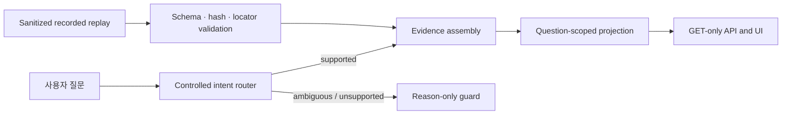
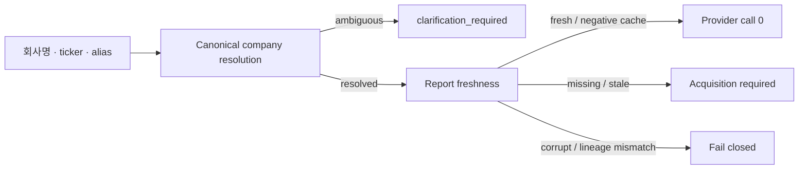
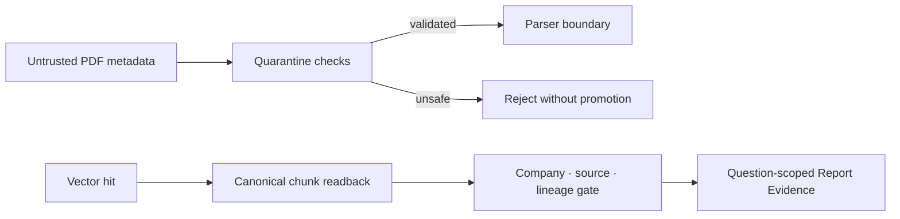

# Architecture

공개 후보는 승인된 recorded replay를 immutable input으로 취급합니다. 질문은
controlled router를 통과한 뒤 해당 intent에 필요한 근거 축만 선택됩니다.
답변 문장은 replay에 포함된 citation-bound observation만 렌더링합니다.

핵심 진입점:

- `run.py`: CLI 시작점
- `src/fia_public/contracts.py`: replay 무결성 및 안전 경계
- `src/fia_public/controlled_router.py`: 질문 intent 분류와 guard
- `src/fia_public/evidence_assembly.py`: 질문별 근거 조립
- `src/fia_public/public_demo.py`: smoke, GET API, HTML UI
- `src/fia_public/report_rag.py`: 페이지·bbox 근거 projection
- `src/fia_public/financial_evidence.py`: 기간·지표 기반 재무 projection
- `src/fia_public/regulatory_evidence.py`: 조문 locator와 적용성 제한
- `src/fia_public/market_analytics.py`: 시장 근거 다섯 category 검증
- `src/fia_public/portfolio_risk.py`: 호출자가 제공한 시계열의 일시적 위험 계산

`portfolio_risk.py`는 알고리즘 경계만 공개하며 recorded replay에 없는 시계열을
만들어내거나 UI 결과로 표시하지 않습니다.

## 범용 runtime 계약

공개 코드는 private company catalog 없이도 다음 orchestration 경계를 실행 가능한
순수 계약으로 보여줍니다.

- `src/fia_public/company_runtime.py`: catalog-backed exact resolution과 ambiguity 계약
- `src/fia_public/freshness.py`: Report 전용 7~14일 freshness와 negative cache 계약
- `src/fia_public/durable_runtime.py`: request idempotency, lease, revision, restart snapshot 상태 머신

실제 상장사 catalog, provider credential, private cache는 공개 저장소에 포함하지
않습니다. 테스트의 회사는 계약 검증용 synthetic record이며 actual 분석 성공으로
계산하지 않습니다.

공개 durable repository는 storage-neutral reference implementation입니다. 실제 서비스의
PostgreSQL 연결이나 암호화된 질문 payload를 포함하지 않으며, 원 질문 대신 hash-safe
identity만 다룹니다. 이를 통해 중복 요청 단일화, lease loss, terminal reason, restart
recovery 계약을 외부 서비스 없이 재현합니다.

## Report RAG 보안·검색 경계

- `src/fia_public/pdf_security.py`: host, MIME, signature, size, active content, resource limit 계약
- `src/fia_public/report_retrieval.py`: vector score와 별개인 company·chunk·lineage hard gate

공개 코드는 parser나 embedding model을 다시 구현하지 않습니다. 입력 검증과 canonical
readback이 통과한 synthetic chunk만 질문 hash에 결박된 Evidence로 선택하며, 원문 PDF와
실제 vector는 포함하지 않습니다.

## Financial Evidence 정규화

`src/fia_public/financial_pipeline.py`는 company/ticker 결박, fiscal period,
report code, 연결·별도, metric, unit, receipt version을 하나의 immutable Evidence로
정규화합니다. 숫자 문자열은 ID 생성 전에 canonical decimal로 변환하므로 표현 형식이
달라도 같은 공시 fact는 같은 Evidence identity를 가집니다.

Financial freshness는 Report의 일수 TTL을 복사하지 않습니다. 저장 receipt와 최신
receipt version이 일치하고 source check가 성공한 경우에만 fresh로 판정합니다. 공개
테스트는 synthetic 값만 사용하며 실제 공시 payload나 corpCode를 포함하지 않습니다.
