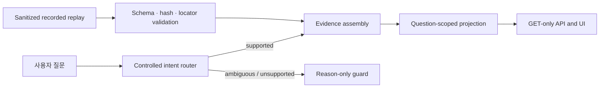

# Architecture

공개 후보는 승인된 recorded replay를 immutable input으로 취급합니다. 질문은
controlled router를 통과한 뒤 해당 intent에 필요한 근거 축만 선택됩니다.
답변 문장은 replay에 포함된 citation-bound observation만 렌더링합니다.

핵심 진입점:

- `run.py`: CLI 시작점
- `src/fia_public/contracts.py`: replay 무결성 및 안전 경계
- `src/fia_public/controlled_router.py`: 질문 intent 분류와 guard
- `src/fia_public/evidence_assembly.py`: 질문별 근거 조립
- `src/fia_public/public_demo.py`: smoke, GET API, HTML UI
- `src/fia_public/report_rag.py`: 페이지·bbox 근거 projection
- `src/fia_public/financial_evidence.py`: 기간·지표 기반 재무 projection
- `src/fia_public/regulatory_evidence.py`: 조문 locator와 적용성 제한
- `src/fia_public/market_analytics.py`: 시장 근거 다섯 category 검증
- `src/fia_public/portfolio_risk.py`: 호출자가 제공한 시계열의 일시적 위험 계산

`portfolio_risk.py`는 알고리즘 경계만 공개하며 recorded replay에 없는 시계열을
만들어내거나 UI 결과로 표시하지 않습니다.
